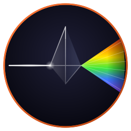

# prism



     

A TUI RGB color picker. Two slots (foreground + background), R/G/B
and H/S/V sliders, hex input, live sample-text preview, WCAG contrast
indicator. Pure ANSI 24-bit truecolor — no kitty graphics dependency,
works in any modern terminal.

Member of the [Fe₂O₃](https://github.com/isene/fe2o3) Rust terminal
suite ([landing page](https://isene.org/fe2o3/)).

<br clear="left"/>

## Features

- **Two color slots.** Edit foreground and background side-by-side,
  Tab to swap which one is active.
- **RGB and HSV at the same time.** Six sliders share one underlying
  color: nudge the hue and the R/G/B values move with it; nudge red
  and the hue/saturation/value follow. Pick whichever axis fits the
  job.
- **Hex input.** Press `#`, type six hex digits, Enter.
- **Live sample text.** A multi-line sample area renders the current
  FG-on-BG against realistic content (heading, code, comments, body
  prose, special characters), so you immediately see whether the
  pair is readable.
- **WCAG contrast.** The contrast ratio between FG and BG is shown
  with a level marker (`AAA ≥ 7 / AA ≥ 4.5 / AA· ≥ 3 / ✗ low`),
  so theme work doesn't ship unreadable pairs.
- **Pipe-friendly output.** On quit, the chosen colors are printed
  to stdout in your chosen format (hex / rgb / hsv / all). Use it
  to drive `sed` against a config file, or capture a single hex
  with `prism --pick`.
- **Tiny.** ~500 KB stripped binary. ~5 MB resident. No async
  runtime, no allocator hot path, no work between keystrokes.

## Install

```bash
PATH="/usr/bin:$PATH" cargo build --release
ln -sf "$(pwd)/target/release/prism" ~/bin/prism
```

## Usage

```sh
prism                    # interactive (pair mode, prints both slots)
prism --pick             # pick a single color (the FG slot)
prism --pair             # explicit pair mode (the default)
prism --hex              # output as #rrggbb (default)
prism --rgb              # output as rgb(R, G, B)
prism --hsv              # output as hsv(H°, S%, V%)
prism --all              # output all three formats
prism --out=FILE         # write the result to FILE instead of stdout
prism #f74c00            # preload FG with this hex
prism #f74c00 #0a0a14    # preload both FG and BG
```

On quit, the chosen colors print to stdout one per line, prefixed
with the slot name (or to `--out=FILE` — see below):

```sh
$ prism --pick
color=#f74c00

$ prism --pair --rgb
fg=rgb(247, 76, 0)
bg=rgb(10, 10, 20)
```

This makes prism easy to script against:

```sh
# Update glassrc fg color
hex=$(prism --pick #$(grep '^fg=' ~/.glassrc | cut -d# -f2) | cut -d= -f2)
sed -i "s/^fg=.*/fg=$hex/" ~/.glassrc
```

To embed prism as a colour picker inside another TUI, use `--out=FILE`:
prism draws on the terminal as usual, but writes the result to the file
instead of stdout, so the host app's screen and prism's UI don't collide.
The caller launches `prism --pair --out=/tmp/pick $FG $BG`, then reads the
chosen colours from the file (this is how [grid](https://github.com/isene/grid)
colours cells).

## Keys

| Key | Action |
|-----|--------|
| `Tab` | swap which slot (FG / BG) is being edited |
| `r` `g` `b` `h` `s` `v` | focus that channel |
| `j` / `↓` / `←` | step focused channel −1 |
| `k` / `↑` / `→` | step focused channel +1 |
| `J` / `Shift-↓` / `Shift-←` | step −10 |
| `K` / `Shift-↑` / `Shift-→` | step +10 |
| `#` | type a hex value (then Enter) |
| `c` | copy current hex to clipboard |
| `o` | cycle output format (hex → rgb → hsv → all) |
| `q` / `Esc` | quit |

## Footprint

- ~500 KB stripped binary
- ~5 MB resident
- Pure ANSI 24-bit truecolor, no kitty graphics dependency
- No subprocess spawns once running, no polling

## Compatibility

Works in any terminal that handles 24-bit truecolor SGR escapes:

- glass, kitty, wezterm, foot, alacritty, st, xterm (with 256 + Tc),
  iTerm2, Apple Terminal (modern)
- tmux: requires `set -g default-terminal "tmux-256color"` and
  `set -ag terminal-overrides ",xterm-256color:RGB"` so SGR 38;2/48;2
  passes through

## Why "prism"

A prism splits white light into its component colors. The picker
splits a single hex value into its R / G / B and H / S / V channels
so you can dial each axis independently while watching the result
on real text.

## Part of Fe₂O₃

| Tool | Repo | Role |
|------|------|------|
| **fe2o3** (umbrella) | <https://github.com/isene/fe2o3> | Suite landing page |
| rush | <https://github.com/isene/rush> | Interactive shell |
| pointer | <https://github.com/isene/pointer> | File manager |
| kastrup | <https://github.com/isene/kastrup> | Messaging hub |
| scribe | <https://github.com/isene/scribe> | Modal editor |
| scroll | <https://github.com/isene/scroll> | Web browser |
| tock | <https://github.com/isene/tock> | Calendar |
| astro | <https://github.com/isene/astro> | Astronomy |
| watchit | <https://github.com/isene/watchit> | Movies |
| crush | <https://github.com/isene/crush> | rush configurator |
| torii | <https://github.com/isene/torii> | Captive-portal listener |
| **prism** | <https://github.com/isene/prism> | Color picker |

## License

Unlicense (public domain). Borrow or steal whatever you want.
